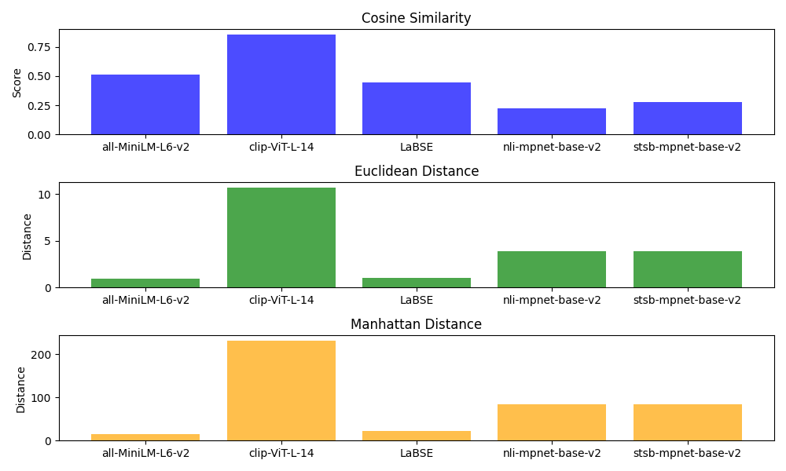

# Text Sentence Similarity using Topsis

## Introduction
**Text Sentence Similarity** is a field within natural language processing (NLP) that focuses on quantifying the degree of similarity or relatedness between pairs of sentences. The goal is to develop models and techniques capable of understanding and measuring the semantic and syntactic similarity between textual expressions. Applications of text sentence similarity include information retrieval, text summarization, question answering, and various other tasks where understanding the semantic relationship between sentences is crucial.

## Metrics Used:
- **Cosine Similarity** - Cosine similarity is employed to measure the similarity between sentence embeddings, quantifying the cosine of the angle between the vectors.
- **Euclidean Distance** - Euclidean distance is utilized as a metric to measure the geometric dissimilarity between sentence embeddings generated by different pre-trained models.
- **Manhattan Distance** - Manhattan distance is utilized as a similarity metric to measure the dissimilarity between sentence embeddings.

## Methodology: TOPSIS
TOPSIS - Technique for Order of Preference by Similarity to Ideal Solution is used to find which model provides us with the best result for sentence similarity. It helps us to consider both the parameters that are to be minimised and maximised to provide a good result.

## Models Evaluated:
- [all-MiniLM-L6-v2](https://huggingface.co/sentence-transformers/all-MiniLM-L6-v2)
- [clip-ViT-L-14](https://huggingface.co/sentence-transformers/clip-ViT-L-14)
- [LaBSE](https://huggingface.co/sentence-transformers/LaBSE)
- [nli-mpnet-base-v2](https://huggingface.co/sentence-transformers/nli-mpnet-base-v2)
- [stsb-mpnet-base-v2](https://huggingface.co/sentence-transformers/stsb-mpnet-base-v2)

These are some of the models that are used for sentence similarity and are picked from [HuggingFace.co](https://huggingface.co/).

## Description of various files
- data.csv - CSV file containing evaluation metrics for each model.
- result.csv - CSV file with ranked results in tabular format
- BarChart.png - Bar chart visualizing the models for data.csv.

## Result
- Topsis Score and Rank
  
|Model|	Cosine_Similarity	| Euclidean_Distance |	Manhattan_Distance	| TOPSIS Score	| Rank |
| :---: | :---: | :---: | :---: | :---: | :---: |
|all-MiniLM-L6-v2 |	0.509319	| 0.96566993 |	14.946816492641986 |	0.5018520988192132 |	2 |
|clip-ViT-L-14 |	0.8562133 |	10.713997 |	232.1482620371195 |	0.5404430504857308 |	1|
|LaBSE | 0.4442811 |	1.0361997 |	22.867854410318007 | 0.4839914049655045 |	3|
|nli-mpnet-base-v2 |	0.22396679 |	3.907006	| 83.92964386 |	0.4259087259946146	| 5 |
|stsb-mpnet-base-v2	| 0.2763004	| 3.8684146	| 83.63490974658514	| 0.43482393667656966	| 4 |

- Bar Chart
  

## Analysis
From the Topsis score comparison of the models, we get `sentence-transformers/all-MiniLM-L6-v2` to be the best model for sentence similarity among all the chosen models.
